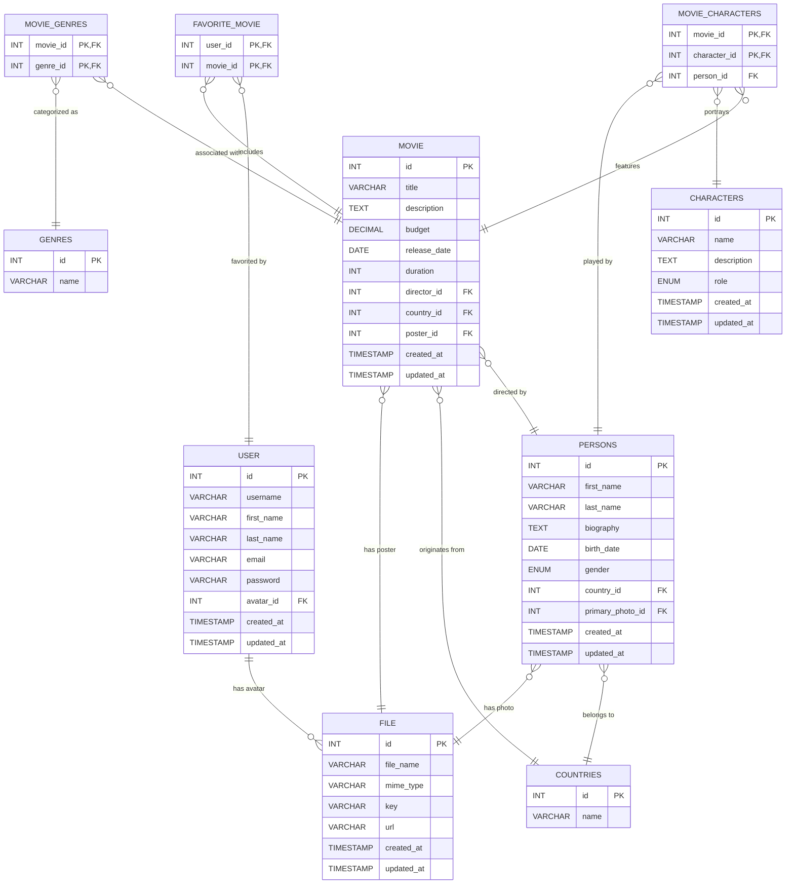

# Before start

## I'm using MySQL for this task, to check the code, I used VS Code with SQLTools extension,

## If you will be using VS Code and SQlTools to test the assignment, in the .vscode folder in the settings.json file, add your MySql server username and password to the username and password field to ensure that the database connection is established through the SQLTools extension.

## Data for testing

Also in the ddl folder, in addition to the [`movie_database.sql`] file with instructions for creating the database, I added the [`test_data.sql`] file along with the insert queries that add data to the database tables and help test database queries, using the test data from the [`test_data.sql`] file, all queries should return data.

# Movie Database ER Diagram

